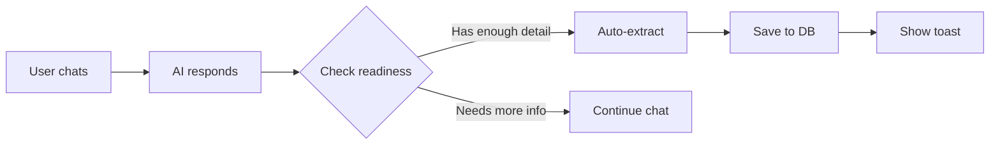

# 💡 AI Idea Chatbot System

> **Intelligent idea capture with AI-powered auto-submission**

An advanced chatbot that uses multi-model LLMs to have natural conversations about ideas and **automatically saves them when ready** - no buttons, no manual steps, just smart automation.

## ✨ Key Features

### 🤖 AI-Powered Auto-Submission
- **No manual "Submit" buttons!** The AI decides when ideas are ready
- Intelligent conversation evaluation after each response
- Automatic extraction and database save when criteria met
- Toast notifications for seamless user feedback

### 🧠 Multi-Model LLM Strategy
- **Chat Model** (`llama-3.1-8b-instant`) - Fast conversational responses
- **Scout Model** (`llama-4-scout-17b`) - Intelligent extraction & evaluation
- **Guard Model** (`llama-guard-4-12b`) - Content safety (future)

### 🎯 Domain-Aware AI
Automatically detects conversation domain and adapts personality:
- 💻 Software Development
- 🏗️ Engineering/Construction
- 👥 HR/People Operations
- 💰 Finance/Accounting
- 💡 General

### 📊 Complete System
- **Backend**: FastAPI with 9 REST API endpoints
- **Database**: SQLite with full CRUD operations
- **Frontend**: Beautiful chat interface + dashboard
- **Memory**: Multi-turn conversation tracking

---

## 🚀 Quick Start

### 1. Install Dependencies
```bash
pip install fastapi uvicorn groq python-dotenv pydantic
```

### 2. Set Up API Key
```bash
# Create .env file
cp .env.example .env

# Add your Groq API key
GROQ_API_KEY=your_key_here
```

Get your free API key at: https://console.groq.com/

### 3. Start the Server
```bash
uvicorn main:app --reload
```

### 4. Open the Chat
Open `prototype-chat.html` in your browser and start chatting!

---

## 💬 Try It Out

**Have this conversation:**

> **You**: I want to build an automated report generation system

> **AI**: [Asks for details]

> **You**: It will pull data from our database and create weekly sales reports. Right now we spend 5 hours a week doing this manually.

> **AI**: [Engages with your idea]

> **You**: I think we can build this in 3 weeks with 2 developers. It would cost $15,000 but save 20 hours per month.

**Watch the magic!** ✨

- Server console shows: `🤖 Readiness check: True`
- Automatically extracts and saves: `✅ Idea auto-saved with ID: 1`
- Toast notification appears: "✨ Idea #1 saved automatically!"

---

## 📁 Project Structure

```
Week 23 - Idea Chatbot/
├── main.py                    # FastAPI backend (400+ lines)
├── llm_client.py             # Multi-model Groq client (500+ lines)
├── conversation_manager.py   # Session management (200+ lines)
├── database.py               # SQLite operations (300+ lines)
├── prototype-chat.html       # Chat UI with auto-submit
├── prototype-dashboard.html  # Ideas dashboard
├── .env                      # Your API keys (gitignored)
├── ideas.db                 # SQLite database (auto-created)
└── lessons/                 # 9 teaching guides
    ├── lesson-1.1-fastapi-basics.md
    ├── lesson-2.1-groq-setup.md
    ├── lesson-3.1-structured-output.md
    ├── lesson-4.1-sqlite-basics.md
    └── ...
```

---

## 🔌 API Endpoints

| Endpoint | Method | Purpose |
|----------|--------|---------|
| `/` | GET | Welcome message |
| `/health` | GET | Server status |
| `/chat` | POST | Chat with AI (auto-saves ideas!) |
| `/extract` | POST | Manual idea extraction |
| `/ideas` | GET | List all ideas (paginated) |
| `/ideas/{id}` | GET | Get specific idea |
| `/docs` | GET | Interactive API documentation |

**Visit** http://localhost:8000/docs for interactive API testing!

---

## 🎯 How AI Auto-Submission Works

### The Flow



### The Intelligence

The AI evaluates:
- ✅ Clear idea description?
- ✅ Problem being solved?
- ✅ Practical details? (time/cost/resources/approach)

**No hard rules** like "must have 5 messages" - just smart evaluation!

---

## 📊 Dashboard

Visit `prototype-dashboard.html` to:
- View all saved ideas in a beautiful card layout
- See real-time stats (total, pending, review, approved)
- Filter by status
- See domain badges and complexity indicators
- Navigate between chat and dashboard

---

## 🛠️ Tech Stack

- **Backend**: FastAPI, Python 3.10+
- **AI**: Groq Cloud (llama-3.1, llama-4-scout)
- **Database**: SQLite
- **Frontend**: Vanilla HTML/CSS/JavaScript
- **Validation**: Pydantic

---

## 📚 Learning Modules

This project teaches 7 modules:

1. **Backend Foundation** - FastAPI, Pydantic, CORS
2. **LLM Integration** - Multi-model Groq, domain prompts
3. **Idea Extraction** - Structured JSON output
4. **Data Persistence** - SQLite, CRUD operations
5. **Enhanced Chat UI** - Auto-submission, toast notifications
6. **Idea Dashboard** - Dynamic data display, filtering
7. **Polish** - Error handling, documentation

Each module has detailed lesson guides in the `lessons/` folder!

---

## 🎓 Key Learnings

### 1. Intelligent UX Design
Instead of making users click "Submit", let AI decide when to act. **Automation over manual steps**.

### 2. Multi-Model Strategy
Use different models for different tasks:
- Fast model for chat
- Smart model for reasoning
- Each optimized for its purpose

### 3. Conversational AI
- System prompts shape personality
- History maintains context
- Domain detection personalizes experience

### 4. Production Patterns
- Pydantic validation
- Error handling
- Database persistence  
- RESTful API design

---

## 🔒 Security Notes

- **Never commit `.env`** - it's in `.gitignore`
- **CORS** is set to `*` for development - restrict in production
- **API keys** stored in environment variables
- **Input validation** via Pydantic models

---

## 🚢 Deployment (Optional)

For production deployment:

1. **Update CORS** in `main.py` to specific domains
2. **Use proper database** (PostgreSQL instead of SQLite)
3. **Add authentication** for the API
4. **Deploy backend** to Railway/Render/Fly.io
5. **Deploy frontend** to Vercel/Netlify
6. **Set environment variables** on hosting platform

---

## 🐛 Troubleshooting

### API Connection Error
- Make sure server is running: `uvicorn main:app --reload`
- Check console for errors
- Verify `GROQ_API_KEY` is set in `.env`

### Ideas Not Auto-Saving
- Check server console for readiness checks
- Make sure conversation has enough detail
- Look for error messages in console

### Dashboard Shows "No Ideas"
- Submit an idea via chat first
- Check `ideas.db` file exists
- Verify `/ideas` endpoint works at http://localhost:8000/docs

---

## 🎉 What Makes This Special

Most chatbots require users to manually submit forms. **This one is different.**

It uses AI to understand when a conversation has evolved into a complete, actionable idea - and automatically saves it. No forms, no buttons, no friction.

**This is the future of AI UX: intelligent, proactive, and seamless.**

---

## 📝 License

MIT License - Feel free to use this for learning or building your own projects!

---

## 🙏 Acknowledgments

- **Groq** for lightning-fast LLM inference
- **FastAPI** for the amazing Python web framework
- **Meta** for the Llama models

---

**Built with ❤️ as a learning project in Week 23**

*Happy coding! 🚀*
