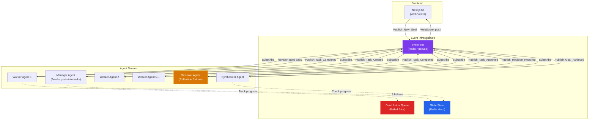

# Architecture: Multi-Agent Swarm with Event-Driven Architecture (EDA)

## What Are We Building?
An AI system where **multiple agents work simultaneously**, communicating through a central "post office" (Event Bus) instead of calling each other like functions. This is how Netflix, Uber, and enterprise AI factories scale to millions of operations.

---

## Part 1: The Core Concept — Pub/Sub

### The Restaurant Analogy 🍕
Imagine a busy pizza restaurant:
- **Old Way (Our AI Researcher):** One waiter takes your order, walks to the kitchen, waits for the chef to finish, carries it back to you, then goes to the next table. If the chef is slow, all other tables wait.
- **New Way (EDA):** The waiter writes your order on a ticket and pins it to a **spinning wheel** (the Event Bus). The waiter immediately goes to the next table. Meanwhile, *any* available chef grabs the ticket, makes the pizza, and rings a bell. Another waiter grabs the finished pizza and delivers it.

Nobody waits. Nobody blocks. The wheel (Event Bus) coordinates everything.

### In Code Terms
```
# OLD WAY (Week 24 — Blocking)
result = scrape_agent(url)        # ⏳ Waits 10 seconds...
judgment = judge_agent(result)    # ⏳ Waits 5 seconds...
report = synthesis_agent(cache)   # ⏳ Waits 8 seconds...
# Total: 23 seconds, sequential

# NEW WAY (Week 25 — Event-Driven)
event_bus.publish("URL_Found", {url: "openai.com"})   # 🚀 Instant! Move on
event_bus.publish("URL_Found", {url: "deepmind.com"}) # 🚀 Instant! Move on
# Workers grab these independently, in parallel, on different machines
```

---

## Part 2: The System Components



---

## Part 3: The Event Flow (Step by Step)

```mermaid
sequenceDiagram
    participant User as Next.js UI
    participant Bus as Event Bus (Redis)
    participant State as State Store
    participant Manager as Manager Agent
    participant Worker as Worker Swarm
    participant Reviewer as Reviewer Agent
    participant DLQ as Dead Letter Queue
    participant Synth as Synthesizer

    User->>Bus: Publish [New_Goal] "Analyze AI Market"
    Bus-->>Manager: Deliver [New_Goal]
    Manager->>State: Create goal (0/3 tasks done)
    
    rect rgb(20, 40, 60)
    Note over Manager,Bus: Task Decomposition
    Manager->>Bus: Publish [Task_Created, priority=NORMAL] "Research OpenAI"
    Manager->>Bus: Publish [Task_Created, priority=NORMAL] "Research DeepMind"
    Manager->>Bus: Publish [Task_Created, priority=NORMAL] "Research Anthropic"
    end

    rect rgb(30, 60, 30)
    Note over Bus,Worker: Swarm grabs tasks in parallel
    Bus-->>Worker: Deliver [Task_Created] OpenAI
    Bus-->>Worker: Deliver [Task_Created] DeepMind
    Worker->>Worker: Heartbeat every 30s ❤️
    Worker->>Bus: Publish [Task_Completed] "OpenAI Data"
    Worker->>Bus: Publish [Task_Completed] "DeepMind Data"
    end

    rect rgb(60, 30, 30)
    Note over Bus,Reviewer: Reflection Pattern
    Bus-->>Reviewer: Deliver [Task_Completed] "OpenAI Data"
    Reviewer->>Reviewer: Reviews quality... BAD!
    Reviewer->>Bus: Publish [Revision_Required, priority=HIGH] "Redo OpenAI"
    
    Bus-->>Worker: Deliver [Revision_Required] (Priority!)
    Worker->>Bus: Publish [Task_Completed] "Fixed OpenAI" (Attempt 2)
    
    Bus-->>Reviewer: Deliver [Task_Completed]
    Reviewer->>Reviewer: Reviews... GOOD!
    Reviewer->>Bus: Publish [Task_Approved]
    Reviewer->>State: Update (1/3 done)
    end

    rect rgb(60, 60, 100)
    Note over State,Synth: Final Synthesis
    Synth->>State: Check: All 3 done? YES!
    Synth->>Bus: Publish [Goal_Achieved] "Final Report"
    Bus-->>User: WebSocket: Display Report
    end
```



---

## Part 4: The 5 Production Patterns (Explained Simply)

### Pattern 1: Dead Letter Queue (DLQ)

> **The Analogy:** Imagine a postal system. If a letter can't be delivered after 3 attempts, the post office doesn't keep trying forever. It sends it to a **"Return to Sender"** pile and notifies you.

**Without DLQ:** If a worker tries to scrape a website 3 times and fails every time, the Reviewer keeps sending it back. The system loops forever: Worker → Reviewer → Worker → Reviewer → ∞.

**With DLQ:** After 3 failed attempts, the event automatically moves to a special "Dead Letter Queue". The system logs it, alerts the user, and moves on to the next task.

```python
# Pseudocode
if task.retry_count >= 3:
    dead_letter_queue.push(task)
    alert_user(f"Task '{task.name}' failed after 3 attempts.")
else:
    task.retry_count += 1
    event_bus.publish("Revision_Required", task)
```

---

### Pattern 2: State Store (Goal Progress Tracker)

> **The Analogy:** Think of a whiteboard in a war room. The general doesn't ask every soldier "are you done?" individually. He looks at the whiteboard which says: `Mission Alpha: 2/5 objectives complete`.

**Without State Store:** The Synthesizer agent has no idea if all sub-tasks are done. It just sits there waiting for events, hoping it received all of them.

**With State Store:** A shared Redis Hash tracks: `{goal_id: "abc", total: 3, completed: 2, failed: 0}`. The Synthesizer periodically checks this store. When `completed == total`, it knows it can compile the final report.

```python
# When a task is approved:
redis.hincrby(f"goal:{goal_id}", "completed", 1)

# Synthesizer checks:
progress = redis.hgetall(f"goal:{goal_id}")
if int(progress["completed"]) >= int(progress["total"]):
    compile_final_report()
```

---

### Pattern 3: Priority Queues

> **The Analogy:** In a hospital ER, a heart attack patient doesn't wait behind someone with a sprained ankle. They get **triaged** — assigned a priority level that determines who gets treated first.

**Without Priority:** A `[Revision_Required]` event (fixing a half-done task) sits behind 50 new `[Task_Created]` events. The worker finishes 50 new tasks before fixing the broken one, wasting the Reviewer's earlier work.

**With Priority:** Revisions are tagged `priority=HIGH`. New tasks are `priority=NORMAL`. The event bus always delivers HIGH priority events first, regardless of when they arrived.

```python
# Publishing with priority
event_bus.publish("Revision_Required", task, priority="HIGH")
event_bus.publish("Task_Created", new_task, priority="NORMAL")

# Worker always grabs HIGH first
next_task = event_bus.pop_highest_priority()
```

---

### Pattern 4: Heartbeat / Health Checks

> **The Analogy:** In the military, a patrol team radios base every 30 minutes to say "We're alive and at checkpoint B." If base doesn't hear anything for 60 minutes, they assume the team is down and send a rescue squad.

**Without Heartbeat:** A Worker grabs a task, then crashes (out of memory, network failure). Nobody knows it crashed. The task just vanishes from the system forever.

**With Heartbeat:** Every 30 seconds, the Worker pings the Event Bus: `"I'm alive, working on Task X"`. If the Bus doesn't receive a heartbeat for 60 seconds, it assumes the Worker is dead and automatically re-publishes the task for another Worker to grab.

```python
# Worker sends heartbeat while working
async def do_work(task):
    while not task.done:
        await event_bus.heartbeat(task.id, worker_id="worker-3")
        await asyncio.sleep(30)

# Event Bus monitors heartbeats
if time_since_last_heartbeat(task.id) > 60:
    event_bus.publish("Task_Created", task)  # Re-queue!
    log.warn(f"Worker died. Re-queued task {task.id}")
```

---

### Pattern 5: Distributed Tracing (Observability)

> **The Analogy:** Imagine tracking a package from Amazon. You get a single tracking number. As the package moves from warehouse → truck → sorting center → delivery van, every handler scans the same barcode. You can see the full journey on one page.

**Without Tracing:** Your user asks "Why did my report take 5 minutes?" You have logs from 15 different agents on 5 different machines. You have no idea which log belongs to which user request.

**With Tracing:** Every event carries a unique `trace_id` (like a tracking number). When Agent A publishes an event, it includes `trace_id: "abc-123"`. When Agent B picks it up, it logs everything under the same `trace_id`. You can then search LangSmith for `"abc-123"` and see the entire journey of that one user request across every agent.

```python
# Event always carries trace_id
event = {
    "type": "Task_Created",
    "trace_id": "abc-123",   # Same ID travels across ALL agents
    "data": {"topic": "Research OpenAI"}
}
event_bus.publish(event)

# Every agent logs under the same trace_id
@traceable(name="worker_agent", metadata={"trace_id": event["trace_id"]})
def process_task(event):
    ...
```

---

## Summary: Before vs After

| Aspect | Week 24 (AI Researcher) | Week 25 (EDA Swarm) |
|---|---|---|
| Communication | Function calls [agent(data)](file:///c:/Users/Kiran/AI%20Practice/Week%2024%20-%20AI%20Researcher/agents.py#161-209) | Events via Pub/Sub |
| Parallelism | `asyncio.gather()` on 1 machine | N workers on N machines |
| Failure | App crashes = data lost | Auto-requeue + DLQ |
| Progress | `len(cache)` in Python memory | Redis State Store |
| Debugging | Print statements | Distributed Tracing |
| Scaling | Buy a bigger laptop | Add more workers |
